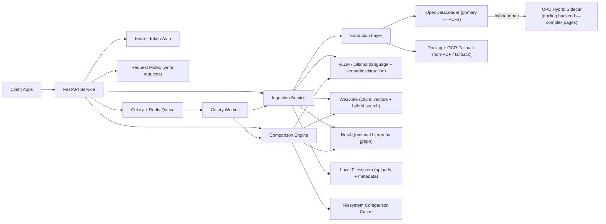
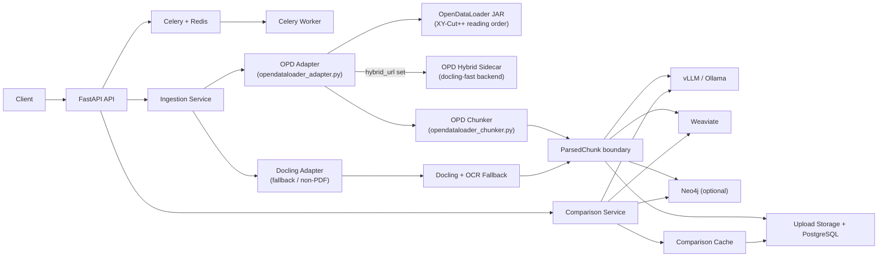
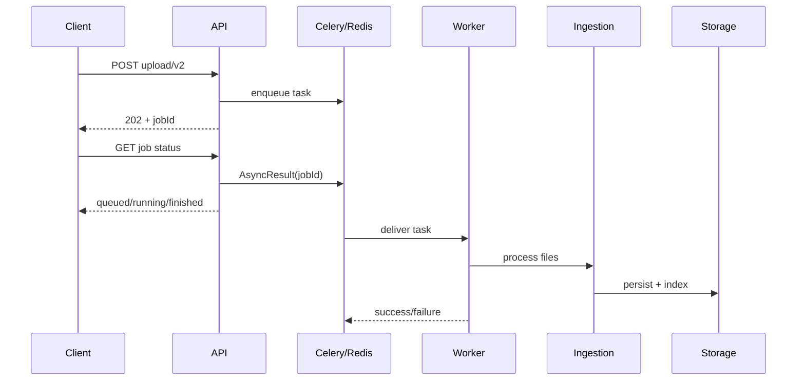
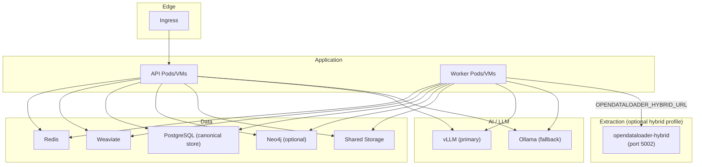

# Architecture Overview

## 1. Brief Introduction

`grc-policy-server` is a backend service for policy document ingestion, indexing, and comparison.
It exposes a FastAPI HTTP API, runs heavy ingestion/comparison tasks asynchronously with Celery, and uses vector/graph stores to support semantic retrieval and policy diff workflows.

At a high level:
- API receives uploads and compare requests.
- Ingestion converts documents into structured chunks and stores them.
- Comparison retrieves indexed chunks and computes structured diffs.
- Optional async endpoints (`/documents/upload/v2`, `/v2/compare`) offload work to Celery workers.

## 2. High-Level Architecture



## 3. UML Diagrams

### 3.1 Component Diagram



### 3.2 Sequence Diagram (Upload V2)



### 3.3 Deployment Diagram



### 3.4 Optional Responsive Zoom/Pan Setup

Use this only in doc platforms that allow custom JS (for example MkDocs/Docusaurus). GitHub markdown will ignore scripts.

```html
<style>
  .mermaid-wrap { width: 100%; overflow: auto; }
  .mermaid-wrap .mermaid { min-width: 720px; }
</style>
<script src="https://cdn.jsdelivr.net/npm/svg-pan-zoom@3.6.1/dist/svg-pan-zoom.min.js"></script>
<script>
  document.addEventListener("DOMContentLoaded", () => {
    document.querySelectorAll(".mermaid svg").forEach((svg, i) => {
      svg.id = svg.id || `mermaid-svg-${i}`;
      svgPanZoom(`#${svg.id}`, {
        zoomEnabled: true,
        controlIconsEnabled: true,
        fit: true,
        center: true,
        minZoom: 0.5,
        maxZoom: 8
      });
    });
  });
</script>
```

## 4. Technologies Involved

- API/runtime: FastAPI, Uvicorn, Pydantic Settings, Structlog/logging
- Async processing: Celery with Redis broker/result backend
- Document extraction (primary — PDF): OpenDataLoader (`opendataloader-pdf`) — XY-Cut++ reading-order extraction with optional docling hybrid backend
- Document extraction (fallback — non-PDF / OPD failure): Docling, pypdfium2, pytesseract (OCR fallback)
- Semantic/LLM layer: vLLM (primary) with Ollama fallback (chat + embeddings)
- Retrieval/index: Weaviate (hybrid/vector search, schema with policy/table fields)
- Canonical store: PostgreSQL (raw extraction JSON + normalized node tree)
- Graph layer (optional): Neo4j
- Storage: local filesystem for uploaded files, metadata, hierarchy, and compare cache
- Tooling: Python (project targets 3.13 in `pyproject.toml`), `uv`, pytest, ruff, mypy
- Containerization: Docker + docker-compose for infra dependencies; `opendataloader-hybrid` sidecar starts with `docker compose up` (always-on)

## 5. Pros

- Clear separation of synchronous API and asynchronous heavy jobs.
- Good fit for retrieval-augmented policy workflows (Docling + Weaviate + semantic extraction).
- Supports both direct endpoints and queue-backed v2 endpoints for production load handling.
- Optional Neo4j integration keeps graph features extensible without forcing that dependency.
- File-based metadata/cache keeps local development straightforward.

## 6. Cons

- Write requests are globally serialized by a lock file, which reduces throughput under load.
- Critical persistence (upload metadata and compare cache) is filesystem-based, not centralized DB-backed.
- Strong runtime dependency on local/reachable Ollama and Weaviate availability.
- Large uploads are base64-encoded for queue payloads in v2 flow, increasing message size overhead.
- Mixed runtime assumptions (Python 3.13 in project config vs 3.12 image in Dockerfile) can cause environment drift.

## 7. Current Limitations

- Horizontal API scaling is constrained by lock-file mutex semantics and shared filesystem assumptions.
- Document listing/deletion depends on `metadata.json` per document directory.
- Neo4j is disabled by default; some graph-enhanced capabilities are optional/inactive unless enabled.
- Compare cache uses local disk TTL files, so cache coherence is instance-local.
- No built-in multi-tenant isolation model beyond bearer token gate.

## 8. Suggestions

- Replace filesystem metadata/cache with a durable datastore (for example Postgres or MongoDB) to support multi-instance deployments.
- Move request serialization from a single process-wide lock to finer-grained idempotency/resource locks.
- Introduce object storage (S3/GCS/MinIO) for uploaded artifacts instead of local disk.
- Add distributed cache/result store strategy for compare outputs (Redis/DB), not local-only files.
- Align runtime versions and build chain (`pyproject`, Docker image, CI) to one Python target.
- Add explicit rate limits and request size guards at ingress/API gateway.
- Extend observability with metrics dashboards and alerts (queue depth, task latency, failure rates).

## 9. Production Requirements

Minimum production requirements for this architecture:

- Infrastructure/services:
  - FastAPI application instances
  - Celery worker instances
  - Redis (broker + result backend)
  - Weaviate (persistent volume)
  - PostgreSQL (canonical document store)
  - vLLM service with required chat + embedding models preloaded (Ollama as fallback)
  - Optional Neo4j cluster/service if graph features are enabled
  - `opendataloader-hybrid` sidecar (port 5002) — starts automatically with `docker compose up`; set `OPENDATALOADER_HYBRID_URL=http://opendataloader-hybrid:5002` to activate
  - Shared/durable storage for uploads and metadata (or replace with object store + DB)

- Configuration and secrets:
  - Set non-default `API_BEARER_TOKEN`
  - Configure all connection URLs and credentials via environment/secret manager
  - Set `UPLOAD_ROOT` to durable storage path
  - Tune Celery worker pool/concurrency/timeouts to hardware profile

- Security:
  - TLS termination at ingress/reverse proxy
  - Restrict CORS from `*` to trusted origins
  - Network policy/firewalling between app and backing services
  - Secret rotation and least-privilege credentials

- Reliability and operations:
  - Health checks and restart policies for API/workers/dependencies
  - Centralized logs + tracing + metrics
  - Backup/restore plan for Weaviate, Neo4j (if used), and uploaded artifacts
  - Capacity planning for CPU/RAM, especially Docling/OCR and embedding workloads

- Delivery:
  - CI for lint/tests/build
  - Versioned container images
  - Rolling deploy strategy with backward-compatible config changes
