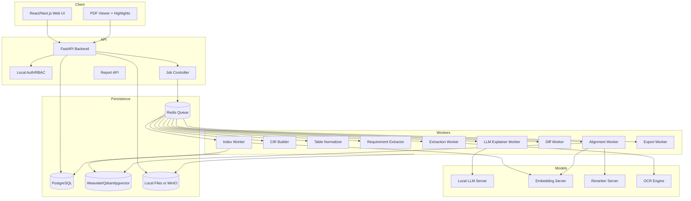

# 01 - Reference Architecture

## Logical architecture



## Deployment patterns

### Development deployment

Use Docker Compose with bind-mounted source code and smaller models.

```text
- app-api
- app-worker
- postgres
- redis
- weaviate or qdrant
- ollama or llama.cpp server
- optional minio
```

Development goals:

- Fast iteration.
- Clear logs.
- Reproducible sample data.
- Agent-friendly scripts.
- Unit and integration tests.

### Production local deployment

Use fixed container images, pinned model files, pinned Python wheels, local package repository, and read-only model directories.

```text
- reverse proxy
- backend replicas if needed
- dedicated worker pools
- model server
- database with backups
- vector DB with backups
- object store
- monitoring
- audit logs
```

Production goals:

- No public internet.
- Stable performance.
- Reliable job recovery.
- Immutable audit evidence.
- Backup and restore.
- Access control.
- Reproducibility.

## Hardware sizing for given machine

Given: i9-class CPU, Nvidia 5070 Ti 16 GB GPU, 64 GB RAM.

Suggested starting limits:

| Workload | Initial concurrency |
|---|---:|
| Active web users | 5 |
| PDF extraction workers | 2 |
| OCR workers | 1 or 2 |
| Table normalization workers | 2 |
| Embedding jobs | 1 |
| Rerank jobs | 1 |
| LLM explanation jobs | 1 or 2 |
| Export jobs | 1 |

Do not run five large LLM generations simultaneously on a 16 GB GPU. Queue LLM explanation jobs and stream progress to the UI.

## Model serving options

| Runtime | Use case |
|---|---|
| Ollama | Easiest MVP and developer setup |
| llama.cpp server | Strong local GGUF deployment, OpenAI-compatible and Anthropic-compatible endpoints, schema constrained JSON |
| vLLM | Higher throughput when supported models and CUDA stack are stable |

Use an internal provider-neutral interface:

```python
class ChatModelClient:
    def generate_json(self, messages: list[dict], schema: dict, temperature: float) -> dict: ...

class EmbeddingClient:
    def embed(self, texts: list[str]) -> list[list[float]]: ...

class RerankerClient:
    def score_pairs(self, pairs: list[tuple[str, str]]) -> list[float]: ...
```

This lets agents and developers swap Ollama, llama.cpp, vLLM, or another local provider without rewriting business logic.

## Service boundaries

### API backend

Should be stateless except for access to DB, object storage, queue, and model client configuration.

### Workers

Workers should be idempotent. A failed job should be safely retryable without duplicating data.

### Model servers

Model servers should be treated as replaceable infrastructure. The app should not depend on vendor-specific prompt templates where avoidable.

### Vector DB

Vector DB contains derived index objects. It can be rebuilt from PostgreSQL and stored CIR files.

## Recommended package structure

```text
app/
  api/
    routes/
    schemas/
    dependencies.py
  core/
    config.py
    logging.py
    security.py
  domain/
    documents/
    extraction/
    cir/
    requirements/
    tables/
    alignment/
    diff/
    explanation/
    citations/
    reports/
  infrastructure/
    db/
    queue/
    object_store/
    vector_store/
    model_clients/
  workers/
    tasks.py
  tests/
```

## Critical invariant

All generated output must trace back to source evidence.

```text
comparison_result -> change_item -> evidence_pair -> source_object -> page -> bbox -> original_pdf_sha256
```
