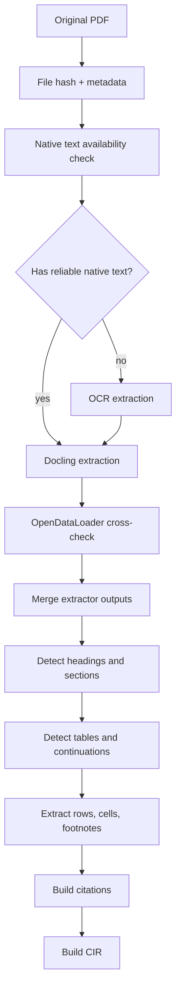

# 03 - PDF Structure and Extraction

## What a PDF is structurally

A PDF is not naturally a semantic document tree. In many PDFs, the file contains pages with positioned glyphs, paths, images, fonts, and coordinates. It may not explicitly contain chapters, paragraphs, tables, headers, or reading order. Some PDFs include tags or bookmarks, but many technical compliance documents do not.

Therefore, the system must reconstruct semantic structure.

## Structures required for compliance comparison

| Structure | Why it matters |
|---|---|
| Page | citation and rendering anchor |
| Heading | section hierarchy and alignment |
| Section number | strongest alignment signal |
| Section title | strong semantic alignment signal |
| Paragraph | source for normative text |
| List item | many requirements are bullets or sub-bullets |
| Table caption | table identity |
| Table header | column meaning and units |
| Table row | often a requirement object |
| Table cell | numeric limits, ranges, classes, conditions |
| Multi-page continuation | prevents false added/removed rows |
| Footnote | exceptions and applicability constraints |
| Cross-reference | references to other sections/tables/standards |
| Figure | test setup or geometry evidence |
| Bounding box | clickable citation and highlight |
| Reading order | correct context and chunking |
| OCR confidence | human review threshold |

## Extractor chain

### Primary extractor: Docling

Use Docling as the first parser for PDF layout, reading order, tables, and structured output.

### Secondary extractor: OpenDataLoader PDF

Use OpenDataLoader PDF as a second parser and for bounding-box rich output. It is also useful as a fallback when Docling table extraction is weak for a particular PDF style.

### Validation tools

Use PyMuPDF and pdfplumber for inspection, page rendering, coordinate verification, text block debugging, and table extraction debugging.

### OCR engines

Use OCR only when native PDF text is absent or unusable.

Recommended default:

```text
Tesseract: baseline offline OCR for eng/deu/fra
PaddleOCR or EasyOCR: fallback for difficult scans or layout-rich documents
```

## Extraction stages



## Native text quality checks

Before OCR, check:

- Is there extractable text?
- Is text order plausible?
- Are common words present?
- Are table cells separated or concatenated?
- Are character encodings valid?
- Are repeated headers/footers dominating the text?

If native text exists but table structure is weak, do not OCR the whole PDF. Use OCR or vision parsing only for table regions.

## Heading detection strategy

Use a weighted classifier:

```text
heading_score =
  0.25 * numbering_pattern
+ 0.20 * font_size_delta
+ 0.15 * bold_or_weight
+ 0.15 * vertical_spacing
+ 0.10 * bookmark_match
+ 0.10 * table_of_contents_match
+ 0.05 * language_heading_keywords
```

Common section number patterns:

```text
1
1.1
1.1.1
A.1
Annex A
Appendix B
5.3.2.1
```

Do not rely only on font size. Standards often have compact formatting where headings and body text differ only slightly.

## Header and footer removal

Repeated page content should be classified as header/footer/watermark.

Detection rules:

- Similar text appears on many pages.
- Similar y-coordinate across pages.
- Contains document code, release label, confidentiality marker, page number.
- Does not belong to any section or table.

Store removed content separately. Do not delete it permanently because document codes and release metadata may be useful.

## Table detection strategy

Combine extractor output with deterministic repair.

Signals:

- Caption pattern: "Table", "Tabelle", "Tableau".
- Grid lines or whitespace-aligned columns.
- Repeated header rows.
- Column-like word alignment.
- Units in headers.
- Frequency/range patterns.
- Page-to-page continuation.

## Multi-page table stitching

A table on page N and a table-like region on page N+1 should be stitched when:

- Captions match, or second page has no new caption.
- Column count and column headers are similar.
- Header row repeats.
- The previous page table ends near the bottom.
- The next page table begins near the top.
- Section context is unchanged.
- Footnote markers carry over.

Pseudocode:

```python
def should_stitch_table(prev, nxt):
    score = 0
    score += similarity(prev.caption, nxt.caption) * 0.20
    score += similarity(prev.normalized_headers, nxt.normalized_headers) * 0.35
    score += int(prev.page_end + 1 == nxt.page_start) * 0.10
    score += int(prev.section_id == nxt.section_id) * 0.15
    score += int(prev.ends_near_page_bottom) * 0.10
    score += int(nxt.starts_near_page_top) * 0.10
    return score >= 0.70
```

## Merged cells

Merged cells often express applicability. Example:

```text
Vehicle category: M1, N1
  150 kHz - 30 MHz | 46 dBuV
  30 MHz - 108 MHz | 40 dBuV
```

The row objects must inherit the merged cell value:

```json
{
  "vehicle_category": "M1, N1",
  "frequency_range": "150 kHz - 30 MHz",
  "limit": "46 dBuV"
}
```

## Table-derived requirements

Each row in a normative table can become a requirement object.

Template:

```text
For [row key columns], under [conditions], [parameter] shall meet [limit/value/class].
```

Do not show this generated text as a source quote. Source quotes must remain original table values.

## Footnote scope

Footnotes can apply to:

- A cell.
- A row.
- A column.
- An entire table.
- A section.

Represent scope explicitly:

```json
{
  "footnote_id": "fn_a",
  "marker": "a",
  "text": "Applies only to high-voltage components.",
  "scope_type": "table_row",
  "scope_object_id": "row_000112"
}
```

## Extraction confidence

Use confidence scoring at every level:

```text
page confidence
block confidence
table confidence
row confidence
cell confidence
OCR confidence
language confidence
requirement extraction confidence
```

When confidence is low, mark comparison items for human review.

## Human review triggers

- Scanned page with OCR confidence below threshold.
- Table stitching confidence below threshold.
- Ambiguous section hierarchy.
- Table row with missing key cells.
- Numeric parse conflict.
- v1/v2 alignment has multiple candidates with similar score.
- LLM explanation has unsupported claims or invalid JSON.
