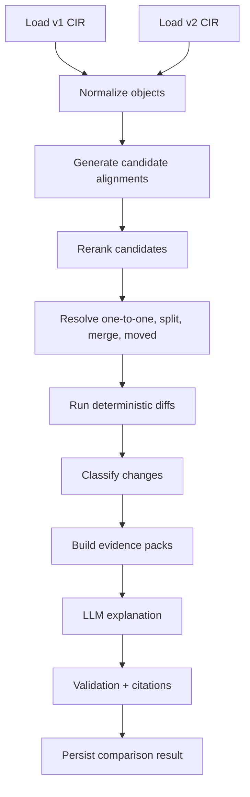

# 05 - Comparison Engine

## Goal

Compare two compliance release documents of the same language and produce cited, classified, auditor-friendly change items.

## Comparison stages



## Object types to compare

- Sections.
- Paragraph requirements.
- List-item requirements.
- Table objects.
- Table rows.
- Table columns.
- Table cells when a high-value cell changed.
- Footnotes.
- Cross-references.

## Alignment, not direct diff

Before diffing, align equivalent objects.

Example:

```text
v1 section 5.3.2 -> v2 section 5.4.1
```

This is a moved section, not a removed and added section.

## Candidate retrieval

For each v1 object, retrieve candidates from v2 using:

- Exact anchors.
- Section path similarity.
- Keyword search.
- Embedding similarity.
- Table schema similarity.
- Numeric pattern similarity.
- Reranker score.

Candidate query input:

```json
{
  "object_type": "table_row",
  "language": "en",
  "section_number": "5.3.2",
  "table_caption": "Test levels for radiated immunity",
  "row_key": "200-400 MHz | AM 80%",
  "normalized_text": "..."
}
```

## Alignment score

Suggested initial formula:

```text
alignment_score =
  0.20 * exact_identifier_score
+ 0.20 * section_path_score
+ 0.15 * title_or_caption_score
+ 0.15 * embedding_score
+ 0.10 * keyword_score
+ 0.10 * table_schema_score
+ 0.05 * numeric_pattern_score
+ 0.05 * reranker_score
```

For table rows, increase table schema and numeric pattern weights.

For paragraphs, increase embedding, keyword, and section path weights.

## Alignment resolution

Classify mappings:

| Mapping | Meaning |
|---|---|
| one_to_one | one v1 object maps to one v2 object |
| added | no v1 match for v2 object |
| removed | no v2 match for v1 object |
| moved | same object found under different section path |
| split | one v1 object maps to multiple v2 objects |
| merged | multiple v1 objects map to one v2 object |
| ambiguous | human review required |

## Deterministic diff rules

### Text requirements

Compare:

- Normative level.
- Subject.
- Action.
- Condition.
- Acceptance criteria.
- Numeric facts.
- References.
- Exceptions.
- Applicability.

### Table rows

Compare:

- Key columns.
- Numeric values.
- Units.
- Ranges.
- Test method.
- Detector.
- Modulation.
- Acceptance criterion.
- Footnote references.
- Applicability.

### Table schemas

Detect:

- Column added.
- Column removed.
- Column renamed.
- Column unit changed.
- Multi-level header changed.
- Key column changed.

### Footnotes

Detect:

- Footnote added.
- Footnote removed.
- Footnote text changed.
- Footnote scope changed.

## Change taxonomy

```text
added_requirement
removed_requirement
modified_requirement
obligation_strengthened
obligation_weakened
numeric_threshold_increased
numeric_threshold_decreased
frequency_range_changed
applicability_expanded
applicability_restricted
test_method_changed
acceptance_criterion_changed
table_added
table_removed
table_row_added
table_row_removed
table_column_added
table_column_removed
table_cell_changed
footnote_added
footnote_removed
footnote_changed
reference_changed
section_moved
section_split
section_merged
formatting_only
ambiguous_requires_review
```

## Numeric comparison examples

```python
def compare_quantity(old, new):
    if old.unit != new.unit:
        converted_old = convert(old, new.unit)
    else:
        converted_old = old

    if converted_old.value == new.value:
        return "unchanged"
    if converted_old.value < new.value:
        return "numeric_threshold_increased"
    return "numeric_threshold_decreased"
```

## Frequency range comparison

```python
def compare_range(old, new):
    if old.lower == new.lower and old.upper == new.upper:
        return "unchanged"
    if new.lower <= old.lower and new.upper >= old.upper:
        return "range_expanded"
    if new.lower >= old.lower and new.upper <= old.upper:
        return "range_restricted"
    return "range_shifted_or_overlapping"
```

## Normative strength ordering

```text
prohibited > mandatory > recommended > permitted > informative
```

Examples:

```text
en: should -> shall = obligation_strengthened
de: sollte -> muss = obligation_strengthened
fr: peut -> doit = obligation_strengthened
```

## Evidence pack

The LLM should receive only the relevant evidence, not whole documents.

```json
{
  "change_id": "CHG-000123",
  "language": "en",
  "machine_classification": "numeric_threshold_increased",
  "v1_evidence": {
    "evidence_id": "E1",
    "document": "OEM_EMC_v1.pdf",
    "release": "v1",
    "section": "5.3.2",
    "table": "Table 12",
    "page": 44,
    "bbox": [72, 380, 520, 410],
    "quote": "200-400 MHz | 30 V/m | AM 80% | Class A"
  },
  "v2_evidence": {
    "evidence_id": "E2",
    "document": "OEM_EMC_v2.pdf",
    "release": "v2",
    "section": "5.3.2",
    "table": "Table 12",
    "page": 47,
    "bbox": [72, 390, 520, 420],
    "quote": "200-400 MHz | 60 V/m | AM 80% | Class A"
  },
  "machine_delta": {
    "field_strength": {"old": "30 V/m", "new": "60 V/m"}
  }
}
```

## LLM output schema

```json
{
  "change_id": "CHG-000123",
  "title": "...",
  "summary": "...",
  "impact": "...",
  "change_type": "numeric_threshold_increased",
  "risk_level": "high",
  "citations": ["E1", "E2"],
  "requires_human_review": false
}
```

## Validation after LLM

Reject or retry if:

- Invalid JSON.
- Missing required fields.
- Citation ID not in evidence pack.
- Explanation mentions facts not present in evidence or machine delta.
- Output language does not match target language.
- Risk level not in enum.

## Confidence score

Suggested confidence:

```text
confidence =
  0.30 * extraction_confidence
+ 0.25 * alignment_confidence
+ 0.25 * diff_confidence
+ 0.10 * citation_confidence
+ 0.10 * llm_validation_confidence
```

Mark human review below 0.75 by default.
