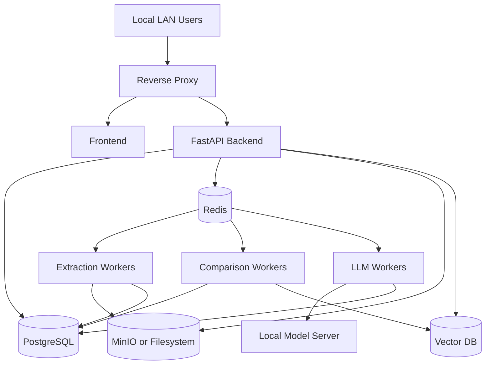

# 09 - Production Local Build Runbook

## Goal

Deploy the GRC Auditor as an offline, local, reproducible web application for at least five concurrent users.

## Production principles

- No public internet access.
- Pinned container images.
- Pinned model files.
- Pinned Python packages.
- Pinned OCR data.
- Immutable audit logs.
- Backups and restore procedure.
- Role-based access control.
- Reproducible comparison results.

## Offline bundle contents

```text
offline_bundle/
  images/
    api.tar
    worker.tar
    frontend.tar
    postgres.tar
    redis.tar
    weaviate_or_qdrant.tar
    model_server.tar
  wheels/
    *.whl
  models/
    llm/
    embeddings/
    reranker/
    ocr/
  config/
    docker-compose.prod.yml
    .env.prod.template
  migrations/
  sample_docs/
  checksums.sha256
  install.sh
  verify.sh
```

## Production topology



## Network policy

Production should allow:

```text
User browser -> reverse proxy
Backend -> DB/Redis/vector/object store/model server
Workers -> DB/Redis/vector/object store/model server
Admin -> backup/monitoring endpoints
```

Production should block:

```text
Containers -> public internet
Model server -> public internet
Backend -> external APIs
Workers -> external APIs
```

## Resource planning

Initial allocation on 64 GB RAM:

| Service | RAM guidance |
|---|---:|
| OS and Docker overhead | 4-8 GB |
| PostgreSQL | 4-8 GB |
| Vector DB | 4-12 GB |
| Redis | 1-2 GB |
| API and frontend | 2-4 GB |
| Workers | 8-16 GB |
| Model server | GPU VRAM + 4-12 GB system RAM |
| File cache | remaining |

## Worker concurrency profile

Start conservative:

```text
EXTRACTION_CONCURRENCY=2
OCR_CONCURRENCY=1
INDEX_CONCURRENCY=1
COMPARE_CONCURRENCY=1
LLM_CONCURRENCY=1
EXPORT_CONCURRENCY=1
```

After load testing:

```text
EXTRACTION_CONCURRENCY=3 or 4
LLM_CONCURRENCY=2 if VRAM allows
```

## Model server tuning

For Ollama:

```text
OLLAMA_NUM_PARALLEL=1 or 2
OLLAMA_MAX_QUEUE=64
OLLAMA_CONTEXT_LENGTH=8192 or 16384
```

For llama.cpp server:

```text
Use quantized GGUF model.
Use GPU layers that fit within 16 GB VRAM.
Enable parallel slots carefully.
Use schema constrained JSON for explanation output when available.
```

For vLLM:

```text
Use when model format and CUDA stack are validated.
Benchmark throughput and memory before production.
Use bounded max model length.
```

## Backup plan

Back up:

- PostgreSQL database.
- Object store: PDFs, CIR snapshots, exports, page renders.
- Vector DB snapshots if available.
- Configuration files.
- Model registry manifests.
- Audit logs.

Minimum schedule:

```text
Daily: database + object store incremental
Weekly: full backup
Monthly: restore drill
```

## Restore plan

A restore is valid only if:

- Original PDFs are present.
- PDF hashes match.
- CIR snapshots are present or can be rebuilt.
- Comparison results reference valid citations.
- Model/prompt/algorithm versions are known.

## Monitoring

Track:

- Job queue length.
- Job failure rate.
- Extraction duration.
- OCR duration.
- LLM tokens/sec.
- LLM failure/retry rate.
- Vector DB query latency.
- DB size and slow queries.
- Disk usage.
- GPU VRAM usage.
- CPU/RAM usage.

## Security hardening

- Run containers as non-root where possible.
- Use local TLS if LAN access is enabled.
- Enforce RBAC by project.
- Encrypt backups if documents are confidential.
- Disable telemetry in all components.
- Store secrets outside source control.
- Use immutable audit logs.
- Scan offline bundle before import.

## Production acceptance checklist

- Upload/extract/index works offline.
- Same-language validation works.
- Mismatch-language comparison is blocked.
- Multi-page table extraction is validated on sample corpus.
- At least 95 percent of expected synthetic changes are detected.
- Every change has citations.
- PDF viewer highlights cited bboxes.
- Report export preserves citations.
- Backup and restore tested.
- Runtime makes no external network calls.
- Five concurrent users can start uploads/compare jobs without UI failure.
